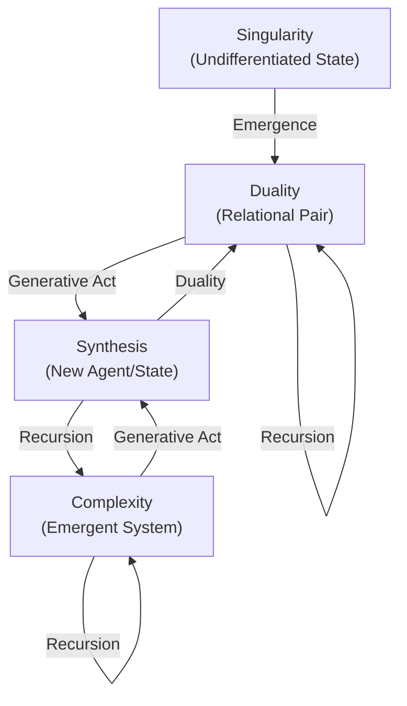
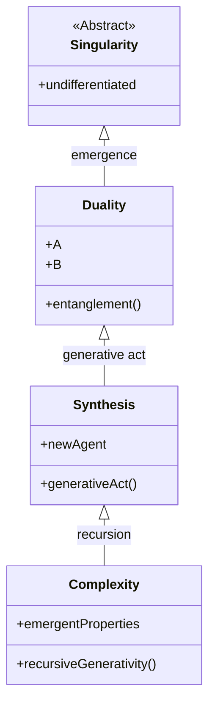

# Duality of Emergence: Mermaid Diagram & Math Equations

## Mermaid Flowchart: Duality and Generativity

## Mermaid Class Diagram: Layered Model

## Beautiful Math Equations

### Formal Duality of Emergence

$$
E \implies \exists\ (A, B) :\ A \neq B\ \wedge\ A \leftrightarrow B
$$

### Generative Recursion

$$
G(S) = S \cup \{f(S)\}
$$

### Recursive Generativity

$$
G^n(S) = G(G^{n-1}(S))
$$

---
*Diagrams and equations ready for use in your research paper, presentation, or documentation.*
