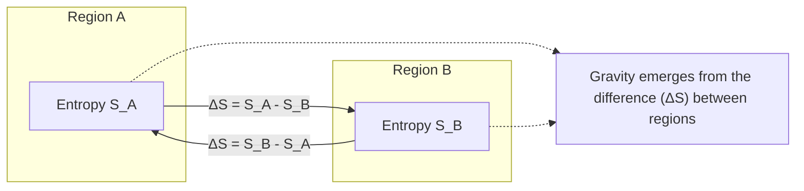

## What Does a Negative ΔS Mean?

A negative entropy difference (ΔS < 0) is not a problem—it simply indicates direction:

- ΔS = S_A − S_B < 0 means region B has higher entropy than region A.
- The sign tells you the direction of the entropic gradient; the magnitude |ΔS| is the size of the difference.
- In emergent gravity models, gravity “pulls” in the direction that tends to balance or minimize entropy differences.
- The negative sign means the gradient points from A to B (or vice versa), not that anything is wrong.

**Summary:**
- Negative ΔS = direction of entropy difference.
- Gravity (or emergent effects) respond to the gradient, not the sign itself.
## Example: Entropy Difference with Numbers

Suppose you have two regions:
- Region A has entropy S_A = 2
- Region B has entropy S_B = 5

The entropy difference is:

	ΔS = S_A − S_B = 2 − 5 = −3

The magnitude of the difference is |ΔS| = 3.

This difference (ΔS) represents the informational or entropic gradient between the two regions, which in emergent gravity models can drive the emergence of gravitational effects.
## Notation: f vs. λ for Functions

In most mathematical writing, **f** is used for standard, named functions (e.g., f(x)), as it is universally recognized and clear to all readers.

**λ** (lambda) is used for anonymous functions, abstraction, or when highlighting connections to logic, computation, or lambda calculus (e.g., λx.x).

**Recommendation:**
- Use **f** for standard, named functions in documentation and equations for maximum clarity.
- Use **λ** only when emphasizing abstraction, anonymous functions, or advanced logic/computation topics.

This approach ensures clarity for most audiences while allowing for advanced notation where appropriate.
## Why Are the Equations So Simple?

The core equations for duality and emergence are simple because they capture the most fundamental relational structure: distinction. At the deepest level, emergence is about the creation of difference, not about complex operations or many variables.

### Why so few symbols?
- Fundamental principles often have elegant, minimal expressions (e.g., E = mc², F = ma).
- The power comes from the interpretation: ΔS = S_A − S_B is simple, but it encodes profound ideas about information, entropy, and relational emergence.
- Most traditional physics and math focus on objects and forces, not on the primacy of relation or distinction itself.

### Why hasn’t this been done before?
- Historically, science has focused on “things” (particles, fields) rather than the logic of emergence and relation.
- Only recently have fields like information theory, quantum gravity, and network science begun to formalize emergence and relationality as first principles.
- The axiom’s simplicity is its strength: it unifies many domains by focusing on the minimal requirement for emergence—distinction.

**Summary:**
- The equations are simple because the underlying principle is irreducible.
- The novelty is in treating relation/distinction as the foundation, not just a byproduct.
- This approach is only now gaining traction as science shifts toward information and emergence.

*This section explains the elegance and power of the duality/emergence equations, and why this perspective is both novel and timely.*
## Greek Symbols and Set Theory Reference

---
Formal Statement of the Duality of Emergence Axiom (plain text for easy copying):

Emergence of structure, information, or complexity is only possible when at least two distinguishable states or entities exist in relation. The minimal condition for emergence is a duality—a distinction between at least two elements—such that their interaction or relationship generates new properties or behaviors not present in isolation. No genuine emergence can arise from a singular, undifferentiated state.

Mathematically: If S is a set, emergence requires |S| ≥ 2, and the existence of a relation R: S × S → P (where P is a set of properties or processes) such that R(a, b) ≠ R(a, a) for a ≠ b.

---

| Symbol | Name         | Meaning/Usage                                 |
|--------|--------------|-----------------------------------------------|
| ∪      | Union        | A ∪ B: all elements in A or B                 |
| ∩      | Intersection | A ∩ B: all elements in both A and B           |
| ∅      | Empty set    | The set with no elements                      |
| ∈      | Element of   | x ∈ A: x is an element of set A               |
| ∉      | Not element  | x ∉ A: x is not an element of set A           |
| ⊆      | Subset       | A ⊆ B: every element of A is in B             |
| ⊂      | Proper subset| A ⊂ B: A is a subset of B, but A ≠ B          |
| ⊇      | Superset     | A ⊇ B: every element of B is in A             |
| ⊃      | Proper superset| A ⊃ B: A is a superset of B, but A ≠ B      |
| ∖      | Set minus    | A ∖ B: elements in A not in B                 |
| Δ      | Delta        | Difference or change (e.g., ΔS = S_A − S_B)   |
| Σ      | Sigma        | Summation (e.g., Σ x_i = x_1 + x_2 + ...)    |
| Π      | Pi           | Product (e.g., Π x_i = x_1 × x_2 × ...)      |
| λ      | Lambda       | Used for eigenvalues, functions, rates, etc.  |
| μ      | Mu           | Mean, micro- (prefix), or measure             |
| θ      | Theta        | Angle, parameter, or variable                 |
| φ      | Phi          | Golden ratio, angle, or variable              |
| ψ      | Psi          | Wave function in quantum mechanics            |
| Ω      | Omega        | Set, sample space, or ohms (resistance)       |
| α      | Alpha        | Angle, coefficient, or variable               |
| β      | Beta         | Angle, coefficient, or variable               |
| γ      | Gamma        | Euler-Mascheroni constant, variable           |
| τ      | Tau          | Time constant, 2π, or variable                |
| ρ      | Rho          | Density, correlation, or variable             |
| σ      | Sigma (lower)| Standard deviation, sum, or variable          |
| ε      | Epsilon      | Small quantity, error, or variable            |
| ζ      | Zeta         | Riemann zeta function, variable               |

---
*This table provides a quick reference for common Greek symbols and set theory notation used in mathematics and physics.*
## When Does Entropy Begin?

Entropy is fundamentally tied to the existence of distinction, difference, or uncertainty. It “begins” the moment emergence creates distinguishable states:

- **Before emergence:** In a true singularity or undifferentiated state, entropy is undefined or zero—there are no differences, no uncertainty.
- **At emergence:** As soon as a distinction appears (e.g., {A, B} with A ≠ B), entropy becomes meaningful. The system now has possible states, and entropy quantifies the uncertainty or information content.
- **After emergence:** Entropy is always present wherever there is distinction, multiplicity, or uncertainty. Positive energy and order can locally decrease entropy, but globally (in a closed system), entropy tends to increase (Second Law of Thermodynamics).

**Summary:**
- Entropy “starts” with the first emergence of distinction or difference.
- It is not “defeated” by positive energy; local decreases in entropy (order) are always offset by greater increases elsewhere.
- Entropy is a measure of possible arrangements or information—not a force, but a property of relational structure.
## Meta-Duality and Gravity

In emergent gravity and quantum information theory, gravity arises from a meta-duality—a fundamental relational distinction between information or entropy states in spacetime.

### Formal Description
- Consider two regions of spacetime, A and B, with entropies S_A and S_B.
- The meta-duality is the set {A, B} with S_A ≠ S_B.
- Gravity emerges as the relational tendency to minimize or balance the difference ΔS = S_A − S_B.
- This is not a force between isolated objects, but an emergent property of the relation (duality) between distinguishable states.

### Diagram: Meta-Duality and Emergent Gravity

---
*This section formalizes the meta-duality underlying gravity as an emergent, relational phenomenon, and provides a diagram for conceptual clarity.*
# Notes on Duality, Distinction, and Emergence

## Key Principle
- Duality is not about the mere presence of two entities, but about the emergence of distinction or relation between them.
- If you have {1, 1}, there is no duality—no distinction, no relational property.
- True duality requires at least one difference: {A, B} with A ≠ B.

## Formal Statement
- The set {A, B} forms a duality if and only if A ≠ B.
- The act of emergence is the creation of difference or relation, not just duplication.
- In set theory: |{A, B}| = 2 and A ≠ B ⇒ duality exists.
- In multisets: {1, 1} does not create a duality; {1, 2} does.

## Implications for the Axiom
- The axiom of Duality of Emergence is about the origin of relational structure, not mere quantity.
- Emergence is fundamentally about the creation of new relations, distinctions, or information.

## Examples

## Recursive Emergence and Growth Beyond Duality

Duality is the minimal condition for emergence, but it is not a limit. Once two distinguishable states exist, recursive interaction between them can generate new states, structures, or patterns—leading to higher complexity.

Conceptual Example:
- Start with duality: {1, 2}
- Interaction/recursion: f(1, 2) → 3 (a new emergent state)
- New set: {1, 2, 3}
- Further recursion: f(2, 3) → 4, so {1, 2, 3, 4}, and so on.

If you subtract back to 1, two more will emerge, giving {1, 2, 3}. If you subtract 1 again, two more will emerge, leading to {1, 2, 3, 4, ...}. This illustrates that duality is the foundation, but recursive emergence builds complexity indefinitely.

Summary:
- Duality enables recursive propagation and generativity.
- Recursive emergence allows the system to grow beyond two states, building complexity and structure.

---
*This note clarifies the mathematical and conceptual basis for duality in the context of the Duality of Emergence axiom.*
