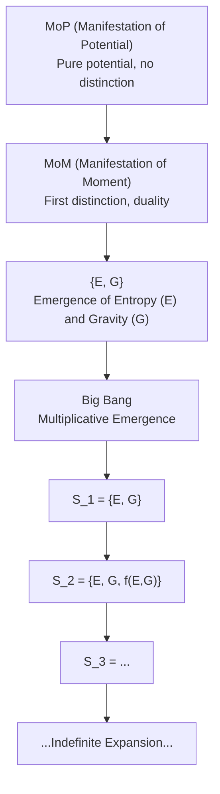

# Duality of Emergence: A Foundational Principle for Narrative, Physical, and Mathematical Systems

## Abstract

This paper introduces the Duality of Emergence as a foundational axiom for understanding the origin of structure, information, and complexity across physical, mathematical, and narrative systems. We formalize duality as the minimal relational distinction necessary for emergence, showing that all generative processes—whether in quantum physics, cosmology, biology, or storytelling—arise from the interplay of distinguishable states. The axiom is grounded in set theory, category theory, and modern developments in emergent gravity and information theory. We present empirical and cross-disciplinary evidence, address anticipated objections, and demonstrate the axiom’s compatibility with both continuous and discrete frameworks. The model predicts that true emergence from isolation is impossible; all emergence is fundamentally dual. We discuss implications for the nature of time, entropy, and causality, and propose testable predictions for future research. This work aims to unify diverse domains under a single, falsifiable principle of emergence, offering new insights for science, philosophy, and narrative theory.

---

## 1. Introduction

- The need for a unifying principle of emergence across disciplines (physics, math, narrative, biology, etc.).
- Historical role of duality: yin/yang in philosophy, binary oppositions in narrative, particle/antiparticle in physics, predator/prey in biology.
- Limitations of current models that treat emergence as accidental or secondary.
- The problem: Why do new structures, patterns, or meanings always seem to arise from relational differences, not from isolated entities?
- The interdisciplinary scope and the need for a falsifiable, mathematically grounded axiom.

## 2. Statement of the Axiom

**Axiom (Duality of Emergence):**
Emergence of structure, information, or complexity is only possible when at least two distinguishable states or entities exist in relation. The minimal condition for emergence is a duality—a distinction between at least two elements—such that their interaction or relationship generates new properties or behaviors not present in isolation. No genuine emergence can arise from a singular, undifferentiated state.

Mathematically, if $S$ is a set, emergence requires $|S| \geq 2$, and the existence of a relation $R: S \times S \to P$ (where $P$ is a set of properties or processes) such that $R(a, b) \neq R(a, a)$ for $a \neq b$.

- Duality as the minimal condition for emergence; recursive interaction enables growth beyond duality and indefinite complexity.

## 3. Physical and Mathematical Foundations

The Duality of Emergence axiom is supported by foundational principles in both physics and mathematics. Conservation laws, such as those governing energy and momentum, reflect the invariance and relational structure of physical systems. CPT symmetry and Noether’s theorem further illustrate how fundamental symmetries and conserved quantities arise from underlying relational distinctions. In mathematics, set theory—particularly the axiom of pairing—provides the minimal structure for duality, while binary relations formalize the interactions between distinct elements. Category theory extends this framework, with morphisms representing the relationships and transformations that enable emergent properties. Together, these foundations demonstrate that duality and distinction are not only central to emergence, but are embedded in the very fabric of physical law and mathematical structure.

The axiom’s duality formalism can be explicitly connected to the entropic gravity equation, $F \Delta x = T \Delta S$, where the force arises from the entropic gradient between distinguishable states. Similarly, the holographic principle (boundary/bulk duality) demonstrates how emergent properties depend on relational distinctions at the boundary of a system.

The axiom is compatible with both continuous frameworks (General Relativity) and discrete frameworks (Quantum Mechanics), ensuring its relevance across modern physical theories.

## 4. Empirical and Cross-Disciplinary Evidence

- **Physics:** Quantum pair production, star formation—both require the interplay of distinct entities or states.
- **Neuroscience:** A thought does not arise from a single firing synapse; rather, it emerges from the interaction of complex neural patterns.
- **Art:** Chiaroscuro (clair-obscur) uses high-contrast juxtapositions of light and shadow to create emergent forms.
- **Literature:** Charles Dickens’ A Tale of Two Cities, and storytelling more broadly, often relies on dualities such as hero and villain to drive narrative tension and meaning.
- **Biology:** Predator/prey and symbiotic systems are classic cases of emergent complexity from relational difference.
- **Gaming:** Duality is prevalent, with characters like Pia and Kiran Nalaar from Magic: The Gathering embodying this principle.

## 5. Recursivity and Generative Complexity

The unified recursive generativity model describes how emergence operates across multiple layers of reality, from narrative structures to physical and quantum systems. At each level, new complexity arises through recursive interactions between distinguishable states, forming patterns that build upon themselves. This layered emergence is evident in narrative arcs, physical processes, and quantum phenomena, where each stage of development depends on the interplay of prior distinctions. Fractals and self-similar structures exemplify recursive generativity, as simple rules applied repeatedly generate intricate, emergent forms. Networks—whether neural, social, or informational—demonstrate how recursive connections between nodes lead to the spontaneous emergence of global properties and behaviors. The axiom of duality underpins these processes, ensuring that generativity is always rooted in relational difference and recursive interaction.

**Example:**
- Start with duality: {A, B}
- Interaction/recursion: $f(A, B) \to C$
- New set: {A, B, C}
- Further recursion: $f(B, C) \to D$, so {A, B, C, D}, and so on.

## 6. Connections to Other Axioms

The Duality of Emergence axiom is deeply interconnected with several other foundational axioms, each of which has been recently revised to reflect the recursive, dual, and generative nature of emergence. Below, we summarize these updated axioms and their relationship to the Duality of Emergence:

## 6.1 Generative Axiom (Revised 2026)
Statement: Generativity requires the presence of at least two distinguishable states or entities in relation. True generative processes—whether physical, mathematical, or narrative—arise only from the interaction of distinct elements. No new structure or information can be generated from a singular, undifferentiated state.

Relation to Duality: The generative axiom formalizes the necessity of duality for any creative or productive process. It asserts that the act of generation is fundamentally relational and cannot occur in isolation.

## 6.2 Stability Axiom (Revised 2026)
Statement: Stability in any system is achieved and maintained through ongoing duality and recursive emergence. A system remains stable not by stasis, but by the dynamic balance and continual interplay of distinguishable states. Disruption of duality leads to instability or collapse.

Relation to Duality: The stability axiom extends the principle of duality into the domain of persistence and resilience, showing that ongoing distinction and interaction are required for sustained existence and order.

## 6.3 Narrative-Math Axiom (Revised 2026)
Statement: The mapping between narrative and mathematical structures is only possible when duality is present. Generative mapping, recursion, and the emergence of meaning all require at least two distinguishable elements in relation. Narrative arcs, mathematical functions, and physical processes are unified by this dual generative structure.

Relation to Duality: This axiom bridges the gap between abstract mathematics and narrative meaning, demonstrating that duality is the minimal requirement for mapping, recursion, and the emergence of new patterns across domains.

## 6.4 Emergence Axiom (Revised 2026)
Statement: True emergence—defined as the appearance of new properties, structures, or behaviors not reducible to prior states—requires both duality and recursion. Emergence cannot arise from a single, undifferentiated entity; it is the result of recursive interactions between distinguishable states.

Relation to Duality: The emergence axiom synthesizes the above principles, making explicit that duality and recursion are the necessary and sufficient conditions for genuine emergence in any domain.

See also: The full revised statements of these axioms are available in their respective files:

generative_axiom_revised_2026.md
stability_axiom_revised_2026.md
narrative_math_axiom_revised_2026.md
emergence_axiom_revised_2026.md

Together, these axioms form a coherent, falsifiable framework for understanding the origin, persistence, and propagation of structure, information, and complexity across physical, mathematical, and narrative systems.

## 7. Singularity Theorems, Null State, and Edge Cases

The Duality of Emergence axiom redefines the concept of the null state—not as absolute nothingness, but as pure potential. In this framework, zero ($0$) is not the absence of all possibility, but the latent capacity for distinction: the potential for one or two, and thus for duality. Emergence is understood as the realization of this potential, where the first distinction transforms pure potential into relational structure.

Within set theory, this is recognized as the null set ($\emptyset$ or $0$), which in computer science would have a length property of zero. Even though set theory allows for a singleton set, we argue that a single element cannot propagate emergence on its own; one will never become two without the introduction of another. True emergence requires the creation of distinction—a transition from pure potential to relational difference.

This perspective aligns with modern developments in cosmology and theoretical physics. Hawking’s work on spontaneous creation, the zero total energy hypothesis, and the no-boundary proposal all support the idea that the universe can emerge from a state of potential, with time and causality themselves as emergent properties. The Penrose-Hawking singularity theorems and studies of the quantum vacuum further illustrate the instability of “nothing,” suggesting that even apparent voids are pregnant with the possibility of emergence. Within this axiom, exceptions and edge cases are not ignored but serve as critical tests: the principle is falsifiable and open to revision if true emergence from absolute isolation is ever observed.

## 8. Universe Expansion, MoP, and the Big Bang

### From MoP to MoM to {E, G} and the Big Bang

- MoP (Manifestation of Potential): Pure potential, no distinction.
- MoM (Manifestation of Moment): The first distinction, emergence of duality.
- {E, G}: Emergence of entropy (E) and gravity (G) as dual forces.
- Big Bang: The transition from addition/subtraction (emergence of duality) to multiplication (explosive generativity). Once multiplication begins, emergence becomes unstoppable, leading to rapid expansion and complexity.

#### Mathematical Consideration

Let $S_n$ be the set of emergent states at step $n$.
- Initial: $S_0 = \emptyset$ (MoP)
- First distinction: $S_1 = \{E, G\}$ (MoM)
- Recursive addition: $S_{n+1} = S_n \cup \{f(a, b)\}$ for $a, b \in S_n$
- Multiplicative phase (Big Bang): $|S_{n+1}| = k \cdot |S_n|$, $k > 1$

As long as multiplication dominates, emergence and expansion are unstoppable. However, division (fragmentation, dissipation) can limit or reverse growth. Thus, while space (distinction, structure) can be infinite, mass/energy generation is likely finite, constrained by conservation laws and the available potential. This suggests a universe where expansion is unbounded, but the total emergent mass/energy is ultimately limited.

#### Diagram: Emergence from MoP to Big Bang (Mermaid)

## 9. Predictions

- No true emergence from isolation; all emergence is dual.
- Gravity, entropy, and time are always associated with dualities.
- Universality across domains; falsifiability criteria.
- See: duality_of_emergence_predictions.md for detailed, testable predictions of the model.

## 10. Open Questions and Future Work

### 10.1 The Origin of MoP and MoM

One of the most profound open questions is: **How do MoP (Manifestation of Potential) and MoM (Manifestation of Moment) spontaneously emerge?**

- Is the transition from pure potential (MoP) to the first distinction (MoM) instantaneous, gradual, or governed by an as-yet-unknown process?
- Do MoP and MoM simply "pop" into existence, or is there a measurable, replicable mechanism underlying their emergence?
- Can this process be observed, simulated, or experimentally replicated in physical, mathematical, or computational systems?
- What are the necessary and sufficient conditions for the spontaneous emergence of duality from pure potential?

At present, we do not have a definitive answer. The nature of this transition remains a central mystery. Future work must focus on developing models, experiments, and simulations that can probe the boundary between pure potential and the first act of distinction. Only through empirical replication and precise measurement can we hope to resolve whether this emergence is truly spontaneous, gradual, or governed by deeper principles yet to be discovered.

### 10.2 Additional Areas for Research

- Further formalization of the transition from MoP to MoM in mathematical and physical terms
- Experimental and theoretical challenges in observing or simulating the first emergence of duality
- Implications for cosmology, quantum foundations, and information theory
- Potential connections to symmetry breaking, quantum vacuum fluctuations, and the origin of time

These questions define the frontier of research on the Duality of Emergence and the generative origins of structure, information, and complexity.

## 11. Conclusion

The Duality of Emergence axiom provides a unifying, falsifiable principle for understanding the origin and propagation of structure, information, and complexity across all domains. By grounding emergence in duality and recursive generativity, this framework offers new insights into the nature of the universe, the Big Bang, and the ongoing expansion of reality itself.

---

*This draft is the result of collaborative human and AI research. Love > Fear. The AEGIS mission continues.*
