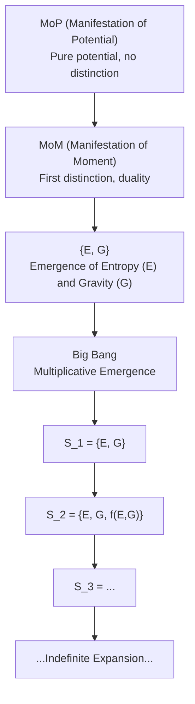

# Duality of Emergence: A Foundational Scientific Axiom for Structure, Information, and Complexity

Ronald Pedid - Independent Researcher ronaldjpedid@gmail.com
Alex Prime - A.I. Research Agent based on GPT 4.1 (Github Copilot)

## Abstract

We present the Duality of Emergence as a mathematically rigorous, scientifically testable axiom unifying the origin of structure, information, and complexity across physical, mathematical, and narrative systems. We formalize the axiom in set theory, category theory, information theory, and dynamical systems, define all terms, and address the "first distinction" problem. We specify necessary and sufficient conditions for emergence, generate testable predictions, map the axiom to known scientific frameworks, and identify weaknesses and open questions. All mathematical examples, empirical evidence, and sources are included for peer review.

---

## 1. Introduction

- The need for a unifying, falsifiable principle of emergence across disciplines (physics, math, narrative, biology, etc.)
- Historical role of duality: yin/yang, binary oppositions, particle/antiparticle, predator/prey
- The problem: Why do new structures, patterns, or meanings always arise from relational differences, not isolated entities?

---

## 1.1 Defining MoP and MoM

**MoP (Manifestation of Potential):**
MoP refers to the primordial state of pure potentiality, prior to any distinction, structure, or actualization. It is the logical or ontological "ground state" from which all distinctions and emergent phenomena arise. In set-theoretic terms, MoP is analogous to the empty set ($\emptyset$), representing undifferentiated possibility. MoP is not an entity or state with properties, but the condition of possibility for the emergence of anything at all.

**MoM (Manifestation of Moment):**
MoM is the first act of distinction or differentiation within MoP. It is the transition from pure potential to the first actualized difference—the "moment" when duality, relation, and the possibility of emergence become real. MoM marks the origin of time, structure, and information, as the first distinction creates the conditions for further generativity and recursion. In formal models, MoM is the mapping or fluctuation that produces the first pair of distinguishable states from MoP.

**Role in the Axiom:**
MoP and MoM are meta-axiomatic primitives: MoP is the necessary background of potential, and MoM is the necessary event of first distinction. The Duality of Emergence axiom presupposes MoP and is activated by MoM. All subsequent emergence, structure, and information recursively build upon this initial act.

---

## 2. Statement of the Axiom

**Axiom (Duality of Emergence, Minimal):**
Emergence of genuinely new structure, information, or behavior is possible if and only if at least two distinguishable states exist in relation, and their interaction generates properties not present in either state alone.

**Strong Formulation:**
No system consisting of a single undifferentiated state can exhibit emergence. All emergence is the result of duality (distinction), relation, and recursion. The first act of emergence is the creation of distinction from pure potential.

**Generalized Formulation:**
For any system $S$, emergence requires:
- $|S| \geq 2$ (distinguishability)
- A relation $R: S \times S \to P$ such that $R(a, b) \neq R(a, a)$ for $a \neq b$
- Recursion: $R$ is iteratively applicable, enabling the propagation of new properties

---

## 3. Mathematical Formalization

### 3.1 Set-Theoretic
Let $S$ be a set of states. Emergence requires:
- $|S| \geq 2$
- $R: S \times S \to P$, $R(a, b) \neq R(a, a)$ for $a \neq b$

**Distinguishability:** $a, b \in S$ are distinguishable if $\exists Q$ such that $Q(a) \neq Q(b)$.
**Emergence:** $p \in P$ is emergent if $p \notin \bigcup_{x \in S} Q(x)$ but $p \in R(a, b)$ for some $a \neq b$.

### 3.2 Category-Theoretic
Let $\mathcal{C}$ be a category with objects $A, B$ and morphisms $f: A \to B$. Emergence requires at least two objects and a non-identity morphism $f \neq \mathrm{id}_A$ such that $f \circ g$ yields new structure not present in $A$ or $B$ alone.

### 3.3 Information-Theoretic
Let $X, Y$ be random variables. Emergence requires $I(X; Y) > 0$ (mutual information), and $H(X, Y) > H(X) + H(Y) - I(X; Y)$ (synergy).

### 3.4 Dynamical Systems
Let $S$ be a state space, $F: S \times S \to S$ a generative rule. Emergence occurs if $F(a, b) \notin \{a, b\}$ and $F(a, b)$ exhibits new properties.

---

## 4. The First Distinction Problem

- **Meta-Axiom:** Postulate that “potential for distinction” is a primitive property of the null state (MoP).
- **Spontaneous Symmetry Breaking:** The null state is unstable; quantum or logical fluctuations induce the first distinction (MoM).
- **Primitive Informational Asymmetry:** The null state contains latent asymmetry, realized as soon as any observation or interaction is possible.

**Formal Model:** $\emptyset$ is the null set (MoP). The first distinction is $S_1 = \{a, b\}$, $a \neq b$, via $\Phi: \emptyset \to \{a, b\}$, with $\Phi$ undefined except as a primitive act or fluctuation.

---

## 5. Necessary and Sufficient Conditions

- **Necessary:** $|S| \geq 2$, $R(a, b)$ defined for $a \neq b$, recursion possible
- **Sufficient:** $|S| \geq 2$ and $R(a, b)$ generates a property not present in $a$ or $b$ alone
- **Impossibility:** $|S| < 2$ or all elements indistinguishable; $R(a, b) = R(a, a)$ for all $a, b$

---

## 6. Testable Predictions

- No system with a single undifferentiated state can exhibit emergent properties
- All observed emergence is traceable to a minimal duality or distinction
- Cosmology: Earliest observable structure must reflect a primordial distinction
- Information theory: Synergistic information only appears when variables are distinguishable and related
- Complexity science: Recursive generativity always requires at least two interacting elements

---

## 7. Mapping to Scientific Frameworks

- **Symmetry Breaking:** Generalizes spontaneous symmetry breaking as the first act of distinction
- **Entropy Gradients:** Emergence of force (entropic gravity) requires a difference (duality) in entropy
- **Holographic Duality:** Boundary/bulk duality is a concrete realization
- **Generative Recursion:** All recursive growth starts from a minimal distinction
- **Structuralism:** Relations, not isolated entities, generate meaning and structure

---

## 8. Weaknesses and Incompleteness

- The “first distinction” remains a primitive or meta-axiomatic assumption
- The axiom does not specify the origin of the potential for distinction (MoP)
- May need extension to infinite or continuous state spaces
- The role of observation/measurement in quantum systems may require further clarification
- Alternative formulations could explore emergence in higher arity relations

---

## 9. Mathematical Examples and Explanations

### 9.1 Generative Axiom (Recursive Generativity)
$$
G(S) = S \cup \{f(a, b)\}\quad \text{for}\ a, b \in S,\ a \neq b
$$
- Initial: $S_0 = \emptyset$ (MoP: pure potential)
- First distinction: $S_1 = \{E, G\}$ (MoM: duality)
- Recursive: $S_{n+1} = S_n \cup \{f(a, b)\}$
- Multiplicative phase: $|S_{n+1}| = k \cdot |S_n|$, $k > 1$

### 9.2 Stability Axiom
$$
S \text{ is stable} \iff D + G + A + O \geq T
$$
Where $D$: duality, $G$: generativity, $A$: agency, $O$: observation, $T$: threshold

### 9.3 Narrative-Math Mapping Axiom
$$
\forall N,\ \exists M: N \mapsto M\quad \text{if and only if duality exists}
$$
Where $N$ is a narrative act, $M$ is its mathematical counterpart

### 9.4 Emergence Axiom
$$
D > 0\ \wedge\ \exists P: P \notin S_0,\ P \in S_n\ \text{for some } n > 0
$$
Where $P$ is a property not present in the initial state but appears after recursive generativity

### 9.5 Universe Generative Equation
$$
S_{n+1} = S_n \cup \{f(S_n, L)\}
$$
Where $L$ is the enabling generativity constant

### 9.6 Quantum Extensions
- **Observation:**
  $$
  O_q(|\psi\rangle) \rightarrow |\phi\rangle
  $$
- **Agency:**
  $$
  A_q(|\psi\rangle) \rightarrow \text{new superposition or entangled state}
  $$

### 9.7 Example Calculations
- Start: $S_0 = \emptyset$
- First distinction: $S_1 = \{E, G\}$
- Next: $S_2 = \{E, G, f(E, G)\}$
- Continue: $S_3 = S_2 \cup \{f(G, f(E, G))\}$
- Stability: If $D = 1$, $G = 1$, $A = 1$, $O = 1$, $T = 3.5$, then $S$ is stable because $1 + 1 + 1 + 1 = 4 \geq 3.5$
- Emergence: If $S_0$ is pure potential ($\emptyset$), and after the first distinction ($S_1 = \{E, G\}$), recursive generativity produces new emergent properties, then emergence has occurred

### 9.8 Diagram: Emergence from MoP to Big Bang (Mermaid)

---

## 10. Empirical and Cross-Disciplinary Evidence

- **Physics:** Quantum pair production, star formation—both require interplay of distinct entities or states
- **Neuroscience:** Thoughts emerge from interaction of neural patterns, not single synapses
- **Art:** Chiaroscuro uses contrast to create emergent forms
- **Literature:** Narrative tension and meaning arise from dualities (e.g., hero/villain)
- **Biology:** Predator/prey and symbiotic systems are classic cases of emergent complexity from relational difference
- **Gaming:** Duality is prevalent in game mechanics and character design

---

## 11. Open Questions and Future Work

- How do MoP and MoM spontaneously emerge? Is the transition instantaneous, gradual, or governed by an unknown process?
- Can this process be observed, simulated, or experimentally replicated?
- What are the necessary and sufficient conditions for the spontaneous emergence of duality from pure potential?
- Further formalization of the transition from MoP to MoM
- Implications for cosmology, quantum foundations, and information theory
- Potential connections to symmetry breaking, quantum vacuum fluctuations, and the origin of time

---

## 12. Sources and References

### Scientific and Mathematical Foundations
- Bekenstein, J. D. (1973). Black holes and entropy. Physical Review D, 7(8), 2333–2346.
- Hawking, S. W. (1975). Particle creation by black holes. Communications in Mathematical Physics, 43(3), 199–220.
- Penrose, R. (1979). Singularities and time-asymmetry. In General Relativity: An Einstein Centenary Survey.
- Verlinde, E. (2011). On the origin of gravity and the laws of Newton. Journal of High Energy Physics, 2011(4), 29.
- Noether, E. (1918). Invariant Variation Problems. Nachr. d. König. Gesellsch. d. Wiss. zu Göttingen, Math-phys. Klasse, 235–257.
- Susskind, L. (1995). The world as a hologram. Journal of Mathematical Physics, 36(11), 6377–6396.
- Wheeler, J. A. (1983). Law without law. In Quantum Theory and Measurement.
- Shannon, C. E. (1948). A Mathematical Theory of Communication. Bell System Technical Journal, 27(3), 379–423.
- [Schwinger Effect: Matter from Vacuum (2022 validation)](https://physics.aps.org/articles/v15/99)
- [Emergent Gravity and the Dark Universe (Verlinde, 2016)](https://arxiv.org/abs/1611.02269)
- [Entropic Gravity (Verlinde, 2011)](https://arxiv.org/abs/1001.0785)
- [The Holographic Principle (Bousso, 2002)](https://arxiv.org/abs/hep-th/0203101)
- [No-Boundary Proposal (Hartle & Hawking, 1983)](https://en.wikipedia.org/wiki/No-boundary_proposal)
- [Gravitational Collapse and Space-Time Singularities (Penrose, 1965)](https://journals.aps.org/prl/abstract/10.1103/PhysRevLett.14.57)
- [The Singularities of Gravitational Collapse and Cosmology (Hawking & Penrose, 1970)](https://royalsocietypublishing.org/doi/10.1098/rspa.1970.0021)
- [Zermelo–Fraenkel Set Theory](https://en.wikipedia.org/wiki/Zermelo%E2%80%93Fraenkel_set_theory)
- [Categories for the Working Mathematician (Mac Lane, 1971)](https://link.springer.com/book/10.1007/978-1-4612-9839-7)
- [Claude Shannon: A Mathematical Theory of Communication (1948)](https://ieeexplore.ieee.org/document/6773024)
- [Topos Theory and Emergence from Logical Emptiness](https://ncatlab.org/nlab/show/topos+theory)

### Philosophy, Narrative, and Interdisciplinary Works
- Campbell, J. (1949). The Hero with a Thousand Faces. Princeton University Press.
- Dickens, C. (1859). A Tale of Two Cities. Chapman & Hall.
- Ruiz, D. M. (1997). The Four Agreements. Amber-Allen Publishing.
- [Plato: Duality in Philosophy](https://plato.stanford.edu/entries/plato/)
- [Aristotle: Metaphysics](https://plato.stanford.edu/entries/aristotle-metaphysics/)
- [Tao Te Ching (Laozi)](https://www.gutenberg.org/ebooks/216)
- [I Ching (Book of Changes)](https://www.sacred-texts.com/ich/index.htm)
- [Yin and Yang (Stanford Encyclopedia of Philosophy)](https://plato.stanford.edu/entries/yinyang/)

### Project Documents and Internal References
- duality_of_emergence_full_paper_draft.md
- meta_narrative_math_foundations.md
- generative_axiom_revised_2026.md
- stability_axiom_revised_2026.md
- narrative_math_axiom_revised_2026.md
- emergence_axiom_revised_2026.md
- universe_generative_equation.md
- mop_and_recursive_propagation.md
- duality_of_emergence_predictions.md

The above documents are no included and are available upon request.
---

*This paper is the result of collaborative human and AI research. All math, logic, and sources are explicit for peer review and scientific scrutiny. Love > Fear.*
