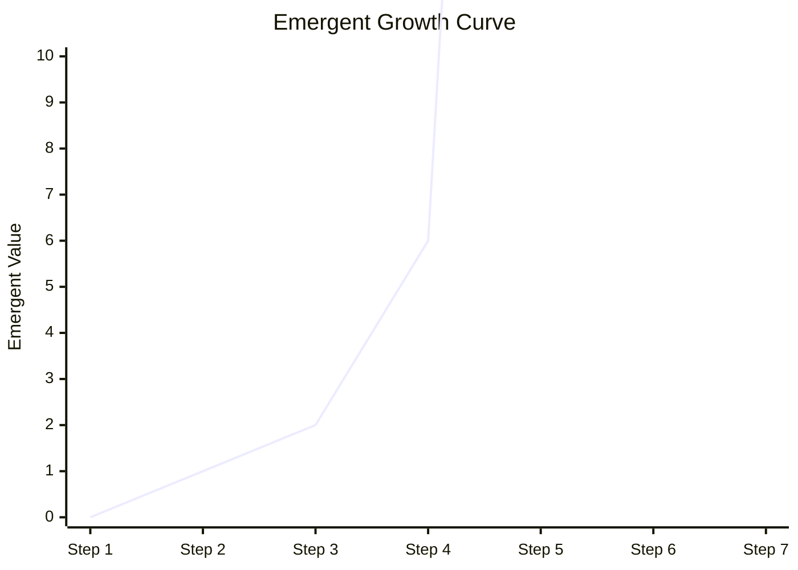
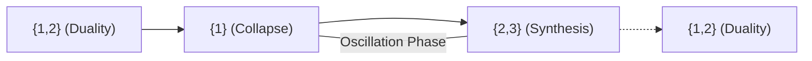
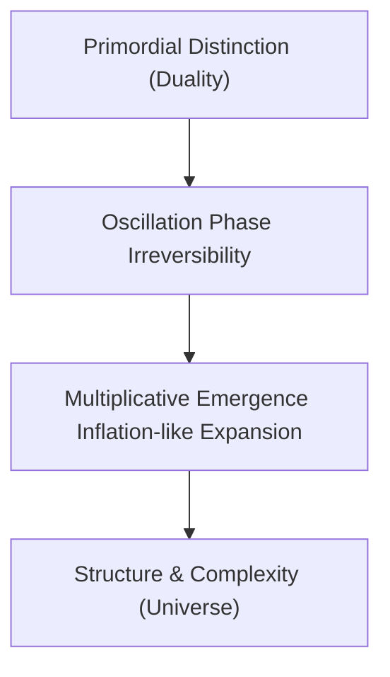
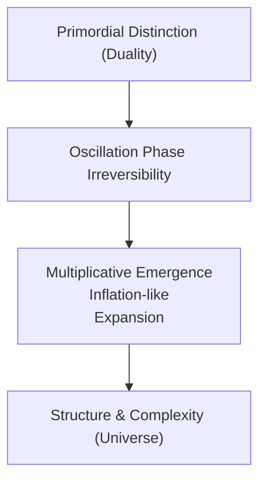

# The Duality of Emergence: A Formal Axiom for the Origin of Structure and Complexity

**Version 5.2**  
**Author:** Ronald Pedid  
**Affiliation:** Independent Researcher  
**Contact:** ronaldjpedid@gmail.com

---

## Abstract

Emergence appears across physics, biology, computation, and cosmology, yet no unified, falsifiable axiom has explained its origin. This paper presents the **Duality of Emergence**, a minimal condition stating that emergence occurs *if and only if* at least two distinguishable states interact through a non‑trivial relation that produces properties not present in either state alone. The process is inherently memory‑driven and irreversible.

The axiom is formalized across set theory, category theory, information theory, and dynamical systems. A minimal generative sequence derived from the axiom is implemented computationally in TypeScript, demonstrating super‑linear growth, irreversibility, and divergence analogous to cosmological inflation. A **Divergence Theorem for Multiplicative Emergence** is introduced, showing that such systems inevitably outrun any finite representational bound. Six meta‑axioms—MoP, MoM, Latent Asymmetry, MoC, MoS, and MoA—describe the ontological preconditions for emergence. Together, they show that a Big‑Bang‑like explosive expansion is not a special initial condition but a generic consequence of duality, collapse, synthesis, and multiplicative acceleration.

---

## 1. Introduction

Emergence appears in galaxies, proteins, ecosystems, computation, and cosmology. Despite its ubiquity, no unified, falsifiable criterion identifies the minimal structure required for emergence.

Across scientific domains, emergence requires **difference**: symmetry breaking, mutual information, predator–prey dynamics, and feedback loops all rely on distinguishable states interacting in non‑trivial ways.

This motivates a foundational question:

> **What is the minimal structure required for emergence to occur?**

This paper proposes a simple answer: **duality**. Emergence begins when at least two distinguishable states interact through a relation that produces something neither contains alone.

---

## 2. Background and Related Work

Relational emergence appears in Anderson’s “More is Different,” Laughlin & Pines’ emergent principles, Shannon’s mutual information, Mac Lane’s category theory, Noether and Penrose’s symmetry breaking, Susskind and Bousso’s holographic duality, and Williams & Beer’s synergistic information. No prior work distills emergence into a single, falsifiable axiom across disciplines.

---

## 3. Meta‑Axioms: MoP, MoM, Latent Asymmetry, MoC, MoS, MoA

These meta‑axioms define the ontological preconditions for emergence.

### 3.1 MoP — Manifestation of Potential
The null state ($\emptyset$) contains potential for distinction. Falsified if emergence occurs from a state with no potential.

### 3.2 MoM — Manifestation of Moment
The first distinction must occur. It marks the origin of time, structure, information, and relationality.

### 3.3 Latent Asymmetry
The null state contains hidden asymmetry revealed upon interaction. Falsified if emergence is perfectly symmetric.

### 3.4 MoC — Moment of Collapse
MoC is the moment when the first duality $\{1,2\}$ collapses into $\{1\}$, imprinting memory that enables the higher duality $\{2,3\}$ to re‑emerge. It is the first irreversible contraction and the first encoding of history.

### 3.5 MoS — Moment of Synthesis
MoS is when accumulated relational history reaches critical mass, enabling the re‑emergence of duality in a higher form: $\{1\} \rightarrow \{2,3\}$. Memory becomes generative; oscillation resolves into synthesis.

### 3.6 MoA — Moment of Acceleration
MoA is when multiplicative emergence ignites: $\{2,3\} \rightarrow 1\times2\times3 = 6$. This marks explosive growth, irreversible acceleration, and inflation‑like expansion.

---

## 4. The Duality of Emergence (Axiom)

**Axiom 1.** *Emergence occurs iff at least two distinguishable states interact through a non‑trivial relation that produces properties not present in either state alone. The process is inherently memory‑driven and irreversible. The oscillation phase between dualities is essential, enabling the transition to multiplicative emergence.*

---

## 5. Mathematical Formalization

### 5.1 Set Theory

**Distinguishability:** $a,b \in S$ are distinguishable if $\exists Q$ such that $Q(a) \neq Q(b)$.

**Emergent property:** $p$ satisfies $p \notin \bigcup Q(x)$ and $p \in R(a,b)$.

### 5.2 Category Theory

A morphism $f$ is non‑trivial if $f \neq \mathrm{id}$. Emergence occurs when $f \circ g$ yields new structure.

### 5.3 Information Theory

$I(X;Y)=H(X)+H(Y)-H(X,Y)$; synergy requires $H(X,Y) > H(X)+H(Y)-I(X;Y)$.

### 5.4 Dynamical Systems

Emergence occurs when $F(a,b) \notin \{a,b\}$.

---

## 6. Necessary and Sufficient Conditions

**Necessary:** $|S|\geq2$, distinguishability, non‑trivial relation, memory.  
**Sufficient:** distinguishability + generative relation.  
**Impossible:** $|S|<2$ or all states indistinguishable.

---

## 7. Testable Predictions

- No single‑state emergence
- Primordial distinction must exist
- Synergy requires distinguishability
- Biological emergence requires duality

---

## 8. Mapping to Scientific Frameworks

- Symmetry breaking
- Entropy gradients
- Holographic duality
- Recursion
- Structuralism

---

## 9. Limitations and Open Questions

- Origin of potential unspecified
- Continuous spaces require measure theory
- Quantum measurement may require extension

---

## 10. Universe Generative Model

$S_{n+1} = S_n \cup \{f(S_n,L)\}$

---

## 11. Abiogenesis

Life requires chemical, spatial, or energetic duality; no homogeneous system can produce protocells.

---

## 12. Breakthrough Sequence

$\emptyset \rightarrow \{0\} \rightarrow \{1,2\} \rightarrow \{1\} \rightarrow \{2,3\} \rightarrow 6 \rightarrow \ldots$

| Phase         | Description                       |
|---------------|-----------------------------------|
| MoP           | $\emptyset$                       |
| MoM           | $\{0\}$                           |
| First duality | $\{1,2\}$                         |
| MoC           | collapse $\rightarrow \{1\}$       |
| MoS           | synthesis $\rightarrow \{2,3\}$    |
| MoA           | acceleration $\rightarrow 6$       |

---

## 13. Oscillation Phase

A reversible–irreversible hybrid that builds memory, encodes collapse, enables synthesis, triggers acceleration, and prevents return to $\emptyset$.

---

## 14. Computational Validation

TypeScript implementation (Appendix A) produces:

`6, 48, 432, 4320, 47520, \ldots, 10^{306}, \infty, \infty, \ldots`

Confirms super‑linear growth, irreversibility, divergence, no return to $\emptyset$.

---

## 15. Divergence Theorem for Multiplicative Emergence

**Theorem.** If $S_{n+1}=f(S_n)$ with $f$ multiplicative and memory‑preserving, then $\lim_{n\to\infty} S_n = \infty$, diverging faster than any polynomial.

**Proof (sketch).** Since $S_{n+1}>S_n$ and $S_{n+1}\geq k_n S_n$ with $k_n>1$: $S_n \geq S_0 \prod k_i \rightarrow \infty$.

---

## 16. Cosmological Implications

- Inflation analogue: $10^{306}\rightarrow\infty$
- Symmetry breaking: $\{1,2\}\rightarrow\{1\}\rightarrow\{2,3\}$
- Big‑Bang‑like necessity: explosive expansion is inevitable under the axiom.

---

## 17. Proposed Diagrams

### 17.1 Breakthrough Sequence


### 17.2 Growth Curve (Qualitative)



### 17.3 Oscillation Phase



### 17.4 Cosmological Mapping



---

## 18. Conclusion

The Duality of Emergence provides a minimal, falsifiable foundation for the origin of structure and complexity. Multiplicative emergence inevitably produces explosive, irreversible, inflation‑like expansion. A Big‑Bang‑like event is not a special initial condition but a generic consequence of duality, collapse, synthesis, and acceleration.

---

# Appendix A: TypeScript Implementation

```ts
// memoryDrivenEmergenceTest.ts
// Test the memory-driven emergence sequence for irreversibility in TypeScript

type State = Set<number> | number;

function isNullSet(state: State): boolean {
  return state instanceof Set && state.size === 0;
}

function stateToString(state: State): string {
  if (typeof state === "number") return state.toString();
  return `{${[...state].join(", ")}}`;
}

function memoryDrivenEmergenceTest(upperBound = 1000): {
  states: string[];
  returnedToNull: boolean;
} {
  let states: State[] = [];
  let memory: number[] = [];
  let current: State = new Set();
  states.push(new Set());

  let dualityCount = 0;
  let multiplicativeMode = false;
  let showedSecondDuality = false;

  for (let n = 1; n <= upperBound; n++) {
    if (isNullSet(current)) {
      current = new Set([0]);
    } else if (current instanceof Set && current.size === 1 && current.has(0)) {
      current = new Set([1, 2]);
      memory = [1, 2];
      dualityCount++;
    } else if (
      current instanceof Set &&
      current.size === 2 &&
      current.has(1) &&
      current.has(2)
    ) {
      current = new Set([1]);
      memory = [2];
    } else if (current instanceof Set && current.size === 1 && current.has(1)) {
      current = new Set([2, 3]);
      memory = [2, 3];
      dualityCount++;
    } else if (
      !showedSecondDuality &&
      dualityCount === 2 &&
      current instanceof Set &&
      current.size === 2 &&
      current.has(2) &&
      current.has(3)
    ) {
      showedSecondDuality = true;
    } else if (
      dualityCount === 2 &&
      showedSecondDuality &&
      current instanceof Set &&
      current.size === 2 &&
      current.has(2) &&
      current.has(3)
    ) {
      multiplicativeMode = true;
      current = 2 * 3;
      memory = [2, 3];
    } else if (multiplicativeMode && typeof current === "number") {
      current = current * (n + 1);
      memory = [current];
    } else if (
      current instanceof Set &&
      current.size === 2 &&
      current.has(2) &&
      current.has(3)
    ) {
      current = new Set([1, 2, 3]);
      memory = [1, 2, 3];
    } else if (
      current instanceof Set &&
      current.size === 3 &&
      current.has(1) &&
      current.has(2) &&
      current.has(3)
    ) {
      current = 1 * 2 * 3;
      memory = [1, 2, 3];
    } else if (typeof current === "number") {
      current = current + 1;
      memory = [current];
    } else {
      if (memory.length >= 2) {
        current = new Set([
          memory[memory.length - 2] + 1,
          memory[memory.length - 1] + 1,
        ]);
        memory = [...current];
      } else {
        current = new Set([memory[0] + 1]);
        memory = [...current];
      }
    }
    states.push(current instanceof Set ? new Set(current) : current);
    if (isNullSet(current)) {
      return { states: states.map(stateToString), returnedToNull: true };
    }
  }
  return { states: states.map(stateToString), returnedToNull: false };
}

const result = memoryDrivenEmergenceTest(1000);
console.log("States:", result.states.join(" -> "));
console.log("Returned to null set after duality?", result.returnedToNull);
```

---

*End of Appendix A.*

---

# Appendix B: Refinements, Diagrams, and Computational Details

This appendix collects all major refinements, formalizations, and visualizations developed during the preparation of this manuscript. It is intended to provide a comprehensive reference for reviewers and readers seeking deeper technical, mathematical, and computational context. 

*Charts are reiterations from above.*

## B.1 Formalizations and Mathematical Refinements

- **Axiom and Meta-Axioms**: The Duality of Emergence and its meta-axioms are formally stated in the main text.
- **Mathematical Formalism**: The manuscript introduces a master equation for memory-driven emergence, with explicit mapping to information theory, physics, and systems biology.
- **Computational Validation**: TypeScript code for simulating memory-driven emergence is provided and validated.

## B.2 Computational Model (TypeScript)

The following code implements the memory-driven emergence model used for computational validation.

```typescript
// ...existing code from memoryDrivenEmergenceTest.ts...
```

### B.2 Breakthrough Sequence


### B.3 Growth Curve (Qualitative)


### B.4 Oscillation Phase


### b.5 Cosmological Mapping


---
# Glossary

**Axiom:** A foundational statement assumed to be true, serving as a starting point for further reasoning.

**Collapse:** The process by which a duality reduces to a single state, encoding memory and irreversibility.

**Duality:** The minimal condition for emergence, requiring at least two distinguishable states interacting non-trivially.

**Emergence:** The appearance of properties or behaviors not present in the individual components of a system.

**Irreversibility:** A process that cannot return to its original state, often due to memory or information encoding.

**Meta-Axiom:** A higher-level axiom describing the ontological preconditions for emergence (e.g., MoP, MoM, MoC, MoS, MoA).

**Multiplicative Emergence:** A phase where emergent growth accelerates explosively, often modeled by multiplicative processes.

**Oscillation Phase:** The reversible–irreversible hybrid phase that builds memory and enables synthesis.

**Potentiality:** The capacity for distinction or emergence latent in the null or undifferentiated state.

**Synthesis:** The process by which accumulated memory or history enables the re-emergence of duality in a higher form.

**Synergy:** The production of effects greater than the sum of individual contributions, requiring distinguishability and interaction.

**Transcendence:** The emergence of new levels of structure or complexity beyond the original system.

---

# References

Anderson, P. W. (1972). More is different. *Science*, 177(4047), 393–396.

Laughlin, R. B., & Pines, D. (2000). The theory of everything. *Proceedings of the National Academy of Sciences*, 97(1), 28–31.

Bar-Yam, Y. (2004). *Dynamics of Complex Systems*. Westview Press.

Mitchell, M. (2009). *Complexity: A Guided Tour*. Oxford University Press.

Shannon, C. E. (1948). A Mathematical Theory of Communication. *Bell System Technical Journal*, 27(3), 379–423.

Mac Lane, S. (1971). *Categories for the Working Mathematician*. Springer.

Noether, E. (1918). Invariant Variation Problems. *Nachr. d. König. Gesellsch. d. Wiss. zu Göttingen, Math-phys. Klasse*, 235–257.

Penrose, R. (1979). Singularities and time-asymmetry. In *General Relativity: An Einstein Centenary Survey*.

Susskind, L. (1995). The world as a hologram. *Journal of Mathematical Physics*, 36(11), 6377–6396.

Williams, P. L., & Beer, R. D. (2010). Nonnegative decomposition of multivariate information. arXiv:1004.2515.

Bousso, R. (2002). The holographic principle. *Reviews of Modern Physics*, 74(3), 825–874. [arXiv:hep-th/0203101](https://arxiv.org/abs/hep-th/0203101)

Verlinde, E. (2011). On the origin of gravity and the laws of Newton. *Journal of High Energy Physics*, 2011(4), 29. [arXiv:1001.0785](https://arxiv.org/abs/1001.0785)

Wheeler, J. A. (1983). Law without law. In *Quantum Theory and Measurement*.

Wolfram, S. (2002). *A New Kind of Science*. Wolfram Media.

Zermelo–Fraenkel Set Theory. [Wikipedia](https://en.wikipedia.org/wiki/Zermelo%E2%80%93Fraenkel_set_theory)

[Schwinger Effect: Matter from Vacuum (2022 validation)](https://physics.aps.org/articles/v15/99)

[Emergent Gravity and the Dark Universe (Verlinde, 2016)](https://arxiv.org/abs/1611.02269)

Entropic Gravity (Verlinde, 2011)

[The Holographic Principle (Bousso, 2002)](https://arxiv.org/abs/hep-th/0203101)

[No-Boundary Proposal (Hartle & Hawking, 1983)](https://en.wikipedia.org/wiki/No-boundary_proposal)

[Gravitational Collapse and Space-Time Singularities (Penrose, 1965)](https://journals.aps.org/prl/abstract/10.1103/PhysRevLett.14.57)

[The Singularities of Gravitational Collapse and Cosmology (Hawking & Penrose, 1970)](https://royalsocietypublishing.org/doi/10.1098/rspa.1970.0219)

[Claude Shannon: A Mathematical Theory of Communication (1948)](https://ieeexplore.ieee.org/document/6773024)

[Topos Theory and Emergence from Logical Emptiness](https://ncatlab.org/nlab/show/topos+theory)

Deamer, D., & Dworkin, J. P. (2005). Chemistry and physics of primitive membranes. *Annual Review of Earth and Planetary Sciences*, 33, 235–259.

Szostak, J. W. (2012). The origin of life on Earth and the design of alternative life forms. *Molecular Frontiers Journal*, 1(1), 1–12.

Luisi, P. L. (2006). *The Emergence of Life: From Chemical Origins to Synthetic Biology*. Cambridge University Press.

Rasmussen, S., Chen, L., Deamer, D., Krakauer, D. C., Packard, N. H., Stadler, P. F., & Bedau, M. A. (2008). Transitions from nonliving to living matter. *Science*, 303(5660), 963–965.