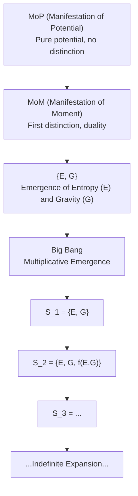

# Meta-Narrative Theory: Mathematical Foundations

---

## Table of Contents
1. Duality of Emergence: Core Mathematical Formalism
2. Generative Axiom: Recursive Generativity
3. Stability Axiom: Persistence and Thresholds
4. Narrative-Math Mapping Axiom
5. Emergence Axiom: Novelty and Complexity
6. Quantum Extensions
7. Example Calculations and Diagrams

---

## 1. Duality of Emergence: Core Mathematical Formalism

**Summary:**
Emergence of structure, information, or complexity is only possible when at least two distinguishable states or entities exist in relation. This is the minimal mathematical condition for emergence.

**Formalism:**
$$
|S| \geq 2,\quad R: S \times S \to P,\quad R(a, b) \neq R(a, a)\ \text{for}\ a \neq b
$$
Where $S$ is a set of states, $P$ is a set of properties or processes, and $R$ is a relation generating new properties from distinction.

---

## 2. Generative Axiom: Recursive Generativity

**Summary:**
True generativity requires duality. New states emerge from the interaction of distinct elements, and recursion enables the growth of complexity.

**Formalism:**
$$
G(S) = S \cup \{f(a, b)\}\quad \text{for}\ a, b \in S,\ a \neq b
$$

- Initial: $S_0 = \emptyset$ (MoP: pure potential)
- First distinction: $S_1 = \{E, G\}$ (MoM: duality)
- Recursive: $S_{n+1} = S_n \cup \{f(a, b)\}$
- Multiplicative phase: $|S_{n+1}| = k \cdot |S_n|$, $k > 1$

---

## 3. Stability Axiom: Persistence and Thresholds

**Summary:**
A system is stable if it maintains sufficient duality, generativity, agency, and observation. Stability is a dynamic balance, not stasis.

**Formalism:**
$$
S \text{ is stable} \iff D + G + A + O \geq T
$$
Where:
- $D$: ongoing distinction/duality
- $G$: generativity
- $A$: agency
- $O$: observation
- $T$: stability threshold

---

## 4. Narrative-Math Mapping Axiom

**Summary:**
All generative narrative acts require duality and map to mathematical operations. This axiom formalizes the correspondence between narrative events and mathematical operations.

**Formalism:**
$$
\forall N,\ \exists M: N \mapsto M\quad \text{if and only if duality exists}
$$
Where $N$ is a narrative act, $M$ is its mathematical counterpart.

---

## 5. Emergence Axiom: Novelty and Complexity

**Summary:**
Emergence occurs only when duality is present and recursive generativity is possible. Novelty and complexity arise from ongoing synthesis and interaction.

**Formalism:**
$$
D > 0\ \wedge\ \exists P: P \notin S_0,\ P \in S_n\ \text{for some } n > 0
$$
Where $P$ is a property not present in the initial state but appears after recursive generativity.

---

## 6. Quantum Extensions

### Quantum Observation and Agency

**Observation:**
$$
O_q(|\psi\rangle) \rightarrow |\phi\rangle
$$
Observation collapses a superposed state $|\psi\rangle$ to an eigenstate $|\phi\rangle$.

**Agency:**
$$
A_q(|\psi\rangle) \rightarrow \text{new superposition or entangled state}
$$

---

## 7. Example Calculations and Diagrams

### Example: Generative Recursion
- Start: $S_0 = \emptyset$
- First distinction: $S_1 = \{E, G\}$
- Next: $S_2 = \{E, G, f(E, G)\}$
- Continue: $S_3 = S_2 \cup \{f(G, f(E, G))\}$

### Stability Example
If $D = 1$, $G = 1$, $A = 1$, $O = 1$, $T = 3.5$, then $S$ is stable because $1 + 1 + 1 + 1 = 4 \geq 3.5$.

### Emergence Example
If $S_0$ is pure potential ($\emptyset$), and after the first distinction ($S_1 = \{E, G\}$), recursive generativity produces new emergent properties, then emergence has occurred.

### Diagram: Emergence from MoP to Big Bang (Mermaid)

---

*This document collects the core mathematical content of the meta-narrative theory for reference and export.*
