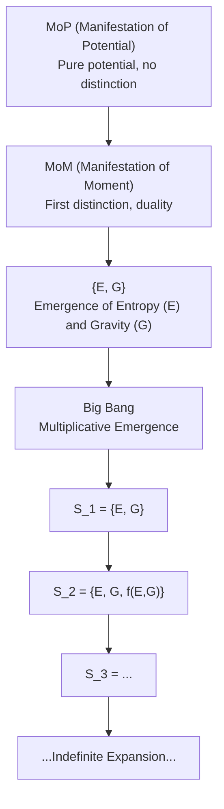

# MoP and Recursive Propagation: Notes on Manifestation of Potential and Emergence

## Acronym: MoP (Manifestation of Potential)

**MoP** stands for Manifestation of Potential, representing the initial state of pure potential before emergence. As emergence occurs, MoP transitions to MoM (Manifestation of Moment), where duality and distinction arise.

## Recursive Propagation with Entropy and Gravity

If we model entropy as (− | fear | 1) and gravity as (+ | love | 2), then subtracting entropy from gravity does not return us to a manifestation of potential. Instead, another duality emerges, giving us {1, 1, 2}. Since {1, 1, 2} is not a true duality, we combine, resulting in {1, 2}. If we continue this process, each subtraction or interaction leads to a new duality, e.g., {1, 3}, and so on. Thus, every subtraction of entropy from gravity generates a new emergent duality, illustrating how recursive propagation works: the system never returns to pure potential, but continually generates new distinctions and structure.

## Universe Expansion and Emergence

This framework explains why the universe’s expansion can outpace the speed of light. In the logic of recursive emergence, space is not a fixed background but an ever-expanding structure. Each new distinction or emergent state adds to the fabric of reality, causing the universe to grow—not by moving matter faster than light, but by creating new “space” at the boundaries. This aligns with modern cosmology: the metric expansion of space can exceed the speed of light because it is space itself expanding, not objects moving through space.

## From MoP to MoM to {E, G} and the Big Bang

- MoP (Manifestation of Potential): Pure potential, no distinction.
- MoM (Manifestation of Moment): The first distinction, emergence of duality.
- {E, G}: Emergence of entropy (E) and gravity (G) as dual forces.
- Big Bang: The transition from addition/subtraction (emergence of duality) to multiplication (explosive generativity). Once multiplication begins, emergence becomes unstoppable, leading to rapid expansion and complexity.

### Mathematical Consideration

Let $S_n$ be the set of emergent states at step $n$.
- Initial: $S_0 = \emptyset$ (MoP)
- First distinction: $S_1 = \{E, G\}$ (MoM)
- Recursive addition: $S_{n+1} = S_n \cup \{f(a, b)\}$ for $a, b \in S_n$
- Multiplicative phase (Big Bang): $|S_{n+1}| = k \cdot |S_n|$, $k > 1$

As long as multiplication dominates, emergence and expansion are unstoppable. However, division (fragmentation, dissipation) can limit or reverse growth. Thus, while space (distinction, structure) can be infinite, mass/energy generation is likely finite, constrained by conservation laws and the available potential. This suggests a universe where expansion is unbounded, but the total emergent mass/energy is ultimately limited.

## Diagram: Emergence from MoP to Big Bang (Mermaid)

## Summary
- MoP is the pure potential state; MoM is the first moment of distinction.
- Duality is the minimal condition for emergence, but recursive propagation allows indefinite growth and complexity.
- Modeling emergence with entropy and gravity shows that the system never collapses back to null, but always generates new structure.
- Recursive emergence explains superluminal expansion of space.
- Multiplicative emergence (post-Big Bang) drives unstoppable growth, but division and conservation limit total mass/energy.
- Space can be infinite; mass/energy is likely finite.
